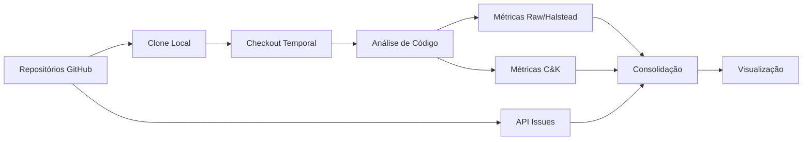
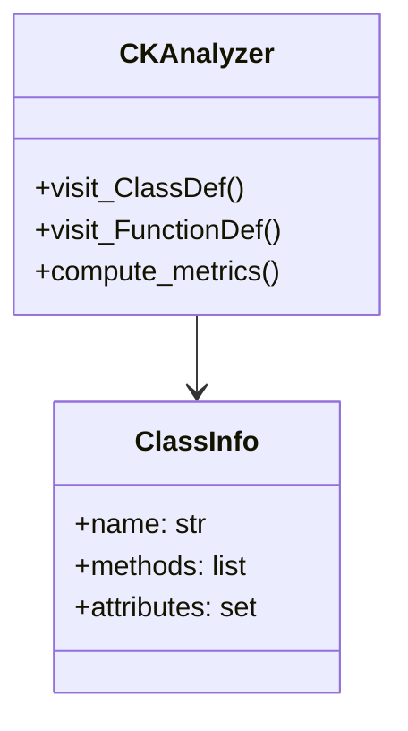

# Documentação do Code Insights

Esta pasta contém a documentação completa do projeto Code Insights.

## 📚 Índice da Documentação

### Documentação Principal
- **[README.md](../README.md)** - Visão geral do projeto e guia rápido
- **[installation-guide.md](installation-guide.md)** - Guia completo de instalação e configuração

### Documentação Técnica
- **[architecture.md](architecture.md)** - Arquitetura do sistema e componentes
- **[api-reference.md](api-reference.md)** - Referência completa da API
- **[pipeline-flow.md](pipeline-flow.md)** - Fluxo detalhado do pipeline de análise
- **[class-diagram.md](class-diagram.md)** - Diagrama de classes e métricas C&K

## 🚀 Início Rápido

1. **Instalação**: Siga o [Guia de Instalação](installation-guide.md)
2. **Configuração**: Configure token GitHub e diretórios
3. **Primeiro Uso**: Execute `python main.py` ou `streamlit run visualization.py`
4. **API**: Consulte [API Reference](api-reference.md) para uso programático

## 📋 Visão Geral das Funcionalidades

### Métricas Suportadas
- **Raw/Halstead**: LOC, LLOC, SLOC, Complexidade, Manutenibilidade
- **Chidamber & Kemerer**: WMC, DIT, NOC, RFC, CBO, LCOM
- **Issues GitHub**: Análise temporal de issues via API GraphQL

### Interfaces Disponíveis
- **CLI**: Interface de linha de comando (`main.py`)
- **Web**: Dashboard interativo Streamlit (`visualization.py`)
- **API**: Uso programático via imports Python

## 🏗️ Arquitetura

```
Code Insights
├── Interface Layer
│   ├── Streamlit UI (visualization.py)
│   └── CLI Interface (main.py)
├── Business Logic Layer  
│   ├── Analytics Module (analytics.py)
│   ├── Issues Module (issues.py)
│   └── Utils Module (utils.py)
└── Data Layer
    ├── Git Repositories
    ├── GitHub API
    └── Configuration (data.py)
```

## 🔄 Pipeline de Análise

1. **Clonagem de Repositórios** - Download automático
2. **Obtenção de Issues** - API GraphQL GitHub V4
3. **Marcos Temporais** - Seleção de datas para análise
4. **Checkout por Revisão** - Navegação temporal
5. **Métricas Raw/Halstead** - Cálculo por revisão
6. **Métricas C&K** - Análise orientada a objetos
7. **Consolidação** - Agregação final

## 📊 Diagramas

### Fluxo de Dados


### Arquitetura de Classes


## 🔧 Configuração

### Variáveis de Ambiente
```env
API_KEY=github_personal_access_token
GITHUB_API_URL=https://api.github.com/graphql
CLONE_REPOS_BASE=/path/to/clone/directory
```

### Repositórios Suportados
```python
repos = {
    'django': 'django',
    'scikit-learn': 'scikit-learn', 
    'microsoft': 'vscode',
    # ... adicione seus repositórios
}
```

## 📖 Exemplos de Uso

### Análise Básica
```python
import analytics
import utils

# Clonar e analisar
utils.clone_repo({"django": "django"})
metrics = analytics.get_project_metrics("clones/django/django")
stats = analytics.get_project_statistics(metrics, "main")
```

### Análise Temporal
```python
import datetime

dates = [datetime.date(2020, 1, 1), datetime.date(2023, 1, 1)]
for date in dates:
    hash_commit = utils.get_commit_hash_by_date(repo_path, date)
    utils.checkout_git_revision(repo_path, hash_commit)
    metrics = analytics.get_project_metrics(repo_path)
```

### Interface Streamlit
```bash
streamlit run visualization.py
```

## 🛠️ Desenvolvimento

### Estrutura do Projeto
```
code_insights/
├── main.py              # CLI entry point
├── analytics.py         # Core metrics engine  
├── visualization.py     # Streamlit interface
├── issues.py           # GitHub integration
├── utils.py            # Git utilities
├── data.py             # Configuration
├── requirements.txt    # Dependencies
├── docs/              # Documentation
└── current/           # Revision cache
```

### Extensibilidade
- **Novas Métricas**: Estender `CKAnalyzer`
- **Novas Linguagens**: Implementar novos analisadores
- **Novas Visualizações**: Adicionar componentes Streamlit

## 🆘 Suporte

### Solução de Problemas
- **Token GitHub**: Verificar permissões e validade
- **Dependências**: Reinstalar via `pip install -r requirements.txt`
- **Performance**: Usar SSD, limitar repos, cache de clones

### Recursos
- **Issues**: Reporte bugs no GitHub
- **Logs**: Ativar debug com `logging.basicConfig(level=logging.DEBUG)`
- **API Limits**: Monitorar rate limits da API GitHub

## 🤝 Contribuição

1. Fork do repositório
2. Criar branch para feature
3. Implementar mudanças com testes
4. Documentar alterações
5. Submit Pull Request

### Padrões de Code
- **Docstrings**: Google Style
- **Type Hints**: Em todas as funções
- **Testes**: Cobertura mínima de 80%
- **Linting**: Seguir PEP 8

## 📄 Licença

Este projeto está sob a licença MIT. Veja o arquivo LICENSE para detalhes.

---

**Code Insights** - Documentação completa para análise de qualidade de código 📊