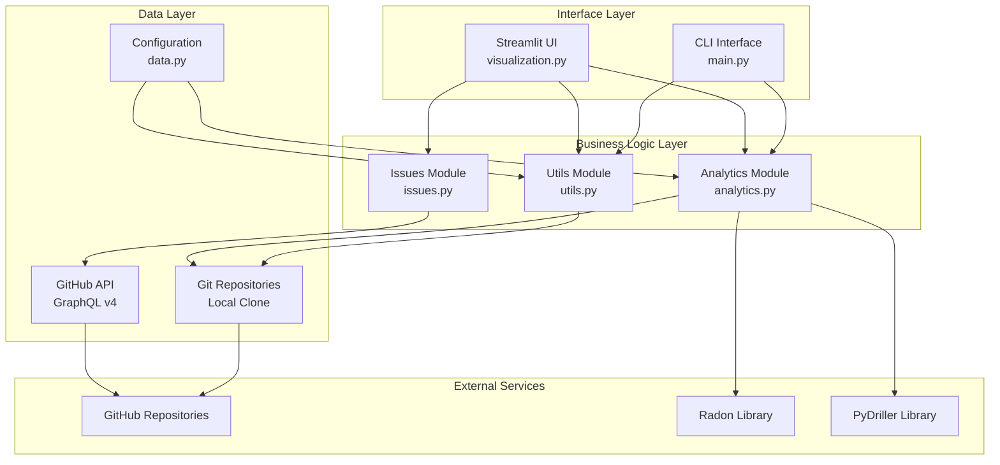
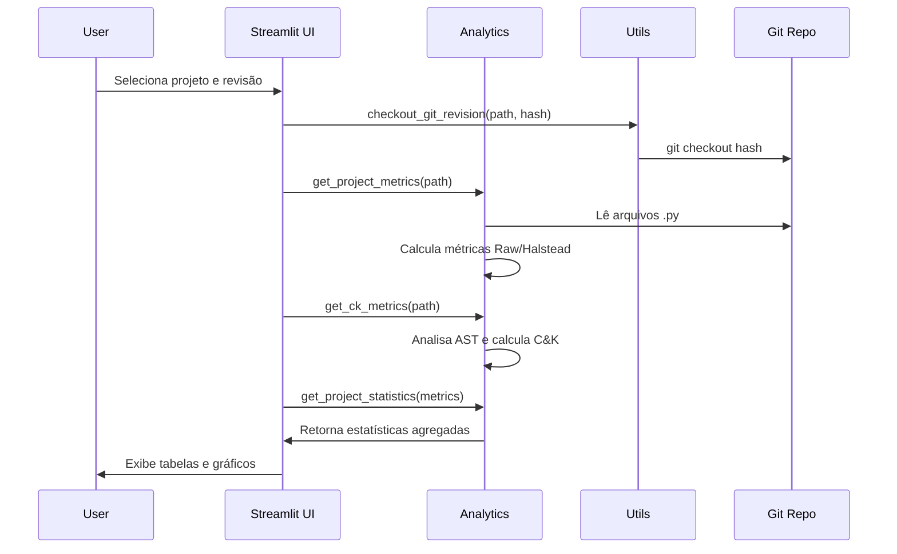
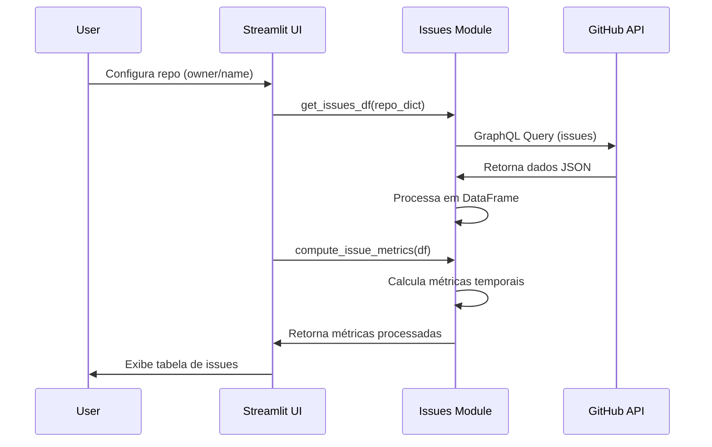

# Arquitetura do Sistema Code Insights

## Visão Geral

O Code Insights é estruturado em uma arquitetura modular que separa responsabilidades entre diferentes componentes, facilitando manutenção e extensibilidade.



## Componentes Principais

### 1. Interface Layer (Camada de Interface)

#### Streamlit UI (`visualization.py`)
- **Responsabilidade**: Interface web interativa
- **Funcionalidades**:
  - Dashboard para visualização de métricas
  - Configuração de parâmetros de análise
  - Exibição de tabelas e gráficos
  - Timeline de marcos temporais
- **Dependências**: analytics.py, issues.py, utils.py

#### CLI Interface (`main.py`)
- **Responsabilidade**: Interface de linha de comando
- **Funcionalidades**:
  - Demonstração básica do sistema
  - Análise simples de projetos
  - Ponto de entrada para automação
- **Dependências**: analytics.py, utils.py

### 2. Business Logic Layer (Camada de Lógica de Negócio)

#### Analytics Module (`analytics.py`)
- **Responsabilidade**: Cálculo de métricas de código
- **Componentes**:
  - `CKAnalyzer`: Analisador AST para métricas C&K
  - `ClassInfo`: Modelo de dados para classes
  - Funções de métricas Raw/Halstead
  - Agregação de estatísticas
- **Métricas Suportadas**:
  - Raw: LOC, LLOC, SLOC, Comments, Blank
  - Halstead: Volume, Difficulty, Effort
  - C&K: WMC, DIT, NOC, RFC, CBO, LCOM
  - Complexidade ciclomática
  - Índice de manutenibilidade

#### Issues Module (`issues.py`)
- **Responsabilidade**: Integração com GitHub API
- **Funcionalidades**:
  - Consulta GraphQL para issues
  - Cálculo de métricas temporais
  - Processamento de dados de issues
- **Métricas de Issues**:
  - Total de issues abertas
  - Duração do projeto
  - Taxa de criação de issues
  - Intervalos entre issues

#### Utils Module (`utils.py`)
- **Responsabilidade**: Utilitários e operações git
- **Funcionalidades**:
  - Clonagem de repositórios
  - Navegação temporal (checkout)
  - Busca de commits por data
  - Gerenciamento de arquivos de configuração
- **Classe Clone**: Pipeline futuro de clonagem

### 3. Data Layer (Camada de Dados)

#### Git Repositories
- **Local Clone**: Repositórios clonados localmente
- **Estrutura**: `CLONE_BASE_PATH/owner/repo/`
- **Versionamento**: Controle via checkout de hashes

#### GitHub API
- **Protocolo**: GraphQL v4
- **Autenticação**: Token pessoal
- **Dados**: Issues, metadados de repositório

#### Configuration (`data.py`)
- **Repositórios**: Lista de repos para análise
- **Formato**: `{"owner": "repo_name"}`

## Fluxo de Dados

### Análise de Métricas de Código


### Análise de Issues


## Padrões de Design Utilizados

### 1. Module Pattern
- Cada arquivo Python representa um módulo independente
- Separação clara de responsabilidades
- Baixo acoplamento entre módulos

### 2. Visitor Pattern
- `CKAnalyzer` implementa visitor para AST
- Flexibilidade para adicionar novas métricas
- Separação entre estrutura e operação

### 3. Strategy Pattern
- Diferentes estratégias de cálculo de métricas
- Métricas Raw vs C&K como estratégias distintas
- Facilita extensão para novas métricas

### 4. Factory Pattern
- `ClassInfo` como factory para dados de classe
- Criação consistente de objetos de análise

## Extensibilidade

### Adicionando Novas Métricas
1. Estender `CKAnalyzer` com novos métodos `visit_*`
2. Adicionar cálculos em `compute_metrics()`
3. Atualizar documentação de retorno

### Suporte a Novas Linguagens
1. Criar novo analisador para linguagem específica
2. Implementar interface comum de métricas
3. Adicionar detecção de tipo de arquivo

### Novos Tipos de Visualização
1. Adicionar funções em `visualization.py`
2. Criar novos componentes Streamlit
3. Integrar com pipeline existente

## Configuração e Deploy

### Variáveis de Ambiente
```env
API_KEY=github_personal_access_token
GITHUB_API_URL=https://api.github.com/graphql
CLONE_REPOS_BASE=/path/to/repos/directory
```

### Dependências Principais
- **streamlit**: Interface web
- **pandas**: Manipulação de dados
- **radon**: Métricas de código Python
- **pydriller**: Análise de repositórios git
- **matplotlib**: Visualizações
- **requests**: API HTTP
- **gitpython**: Operações git

### Estrutura de Arquivos
```
code_insights/
├── main.py                 # CLI entry point
├── analytics.py            # Core metrics engine
├── visualization.py        # Streamlit interface
├── issues.py              # GitHub integration
├── utils.py               # Git utilities
├── data.py                # Configuration
├── requirements.txt       # Dependencies
├── current/              # Current revisions cache
└── clones/              # Local repositories
    └── owner/
        └── repo/
```

## Segurança e Performance

### Segurança
- Token GitHub via variáveis de ambiente
- Validação de entrada de usuário
- Sanitização de caminhos de arquivo

### Performance
- Cache de revisões em arquivos `.ciconf`
- Processamento lazy de métricas
- Reuso de clones locais

### Tratamento de Erros
- Try-catch em operações críticas
- Logs detalhados para debugging
- Fallbacks para operações falhando