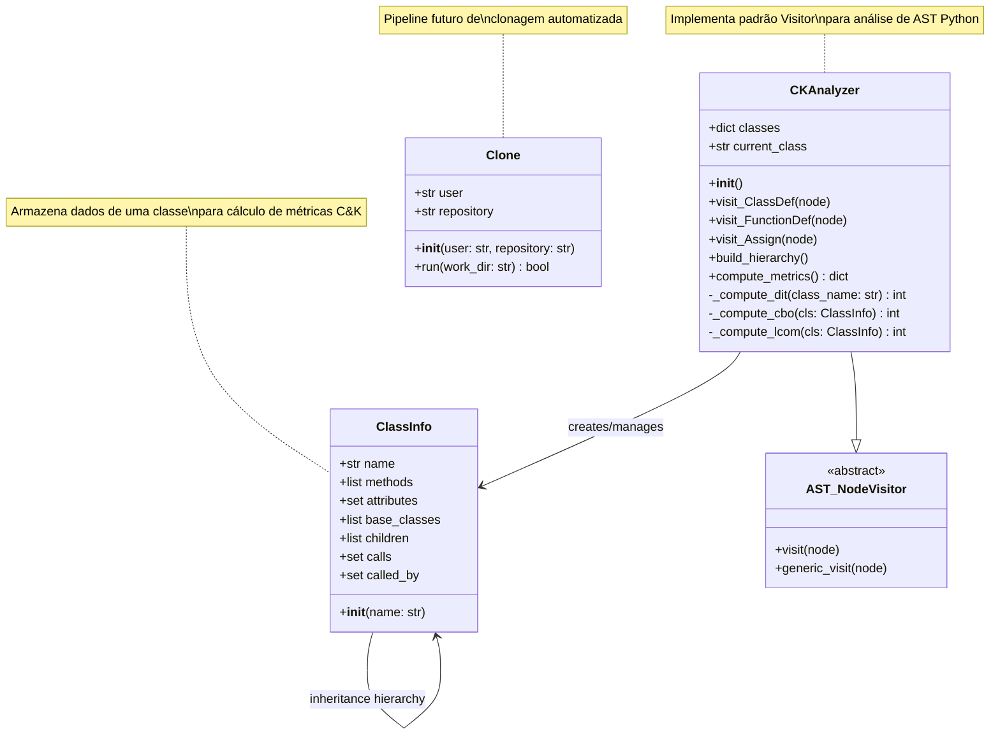
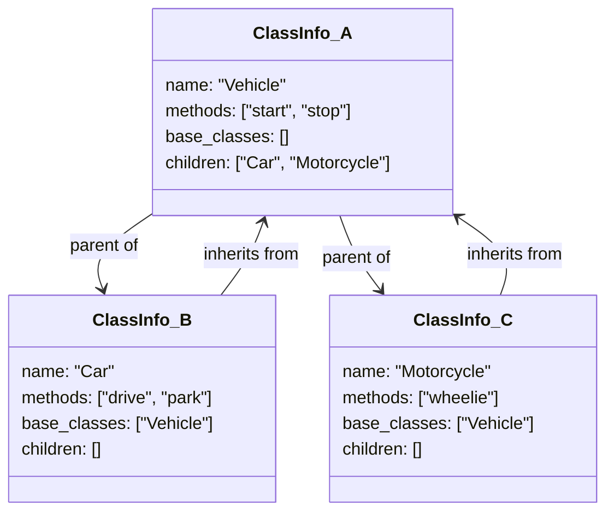
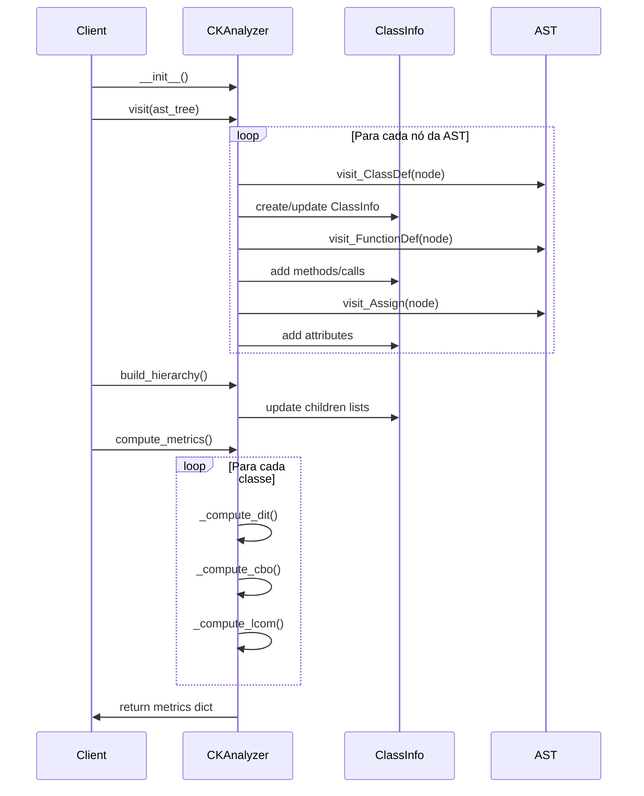

# Diagrama de Classes - Code Insights

## Visão Geral das Classes

O sistema Code Insights é organizado em classes que representam diferentes aspectos da análise de código e métricas C&K.



## Detalhamento das Classes

### ClassInfo
Representa informações completas sobre uma classe Python para análise de métricas C&K.

#### Atributos
- **`name`**: Nome da classe
- **`methods`**: Lista de métodos definidos na classe
- **`attributes`**: Conjunto de atributos acessados na classe
- **`base_classes`**: Classes pai (herança)
- **`children`**: Classes filhas que herdam desta classe
- **`calls`**: Conjunto de chamadas feitas pelos métodos da classe
- **`called_by`**: Classes que fazem chamadas para esta classe

#### Relacionamentos


### CKAnalyzer
Implementa o padrão Visitor para analisar a AST (Abstract Syntax Tree) de código Python e calcular métricas Chidamber & Kemerer.

#### Métodos de Visitação
- **`visit_ClassDef(node)`**: Processa definições de classe
- **`visit_FunctionDef(node)`**: Processa definições de método/função
- **`visit_Assign(node)`**: Processa atribuições (para detectar atributos)

#### Métodos de Cálculo
- **`_compute_dit(class_name)`**: Depth of Inheritance Tree
- **`_compute_cbo(cls)`**: Coupling Between Objects  
- **`_compute_lcom(cls)`**: Lack of Cohesion of Methods

#### Fluxo de Processamento


## Métricas Chidamber & Kemerer Implementadas

### WMC (Weighted Methods per Class)
```python
wmc = len(cls.methods)
```
Conta o número de métodos na classe.

### DIT (Depth of Inheritance Tree)
```python
def _compute_dit(self, class_name):
    visited = set()
    def depth(cls):
        if cls not in self.classes or cls in visited:
            return 0
        visited.add(cls)
        bases = self.classes[cls].base_classes
        return 1 + max((depth(base) for base in bases), default=0)
    return depth(class_name)
```
Calcula a profundidade máxima na árvore de herança.

### NOC (Number of Children)
```python
noc = len(cls.children)
```
Conta o número de classes filhas diretas.

### RFC (Response for a Class)
```python
rfc = len(cls.calls) + len(cls.methods)
```
Soma métodos próprios + métodos externos chamados.

### CBO (Coupling Between Objects)
```python
def _compute_cbo(self, cls):
    external_calls = 0
    for call in cls.calls:
        for other_cls in self.classes.values():
            if other_cls.name != cls.name and call in other_cls.methods:
                external_calls += 1
                break
    return external_calls
```
Conta acoplamentos com outras classes.

### LCOM (Lack of Cohesion of Methods)
```python
def _compute_lcom(self, cls):
    method_attr = []
    for method in cls.methods:
        accessed = set()
        for call in cls.calls:
            if method in call:
                accessed.update(cls.attributes)
        method_attr.append(accessed)
    pairs = [(a, b) for i, a in enumerate(method_attr) for b in method_attr[i+1:]]
    no_shared = sum(1 for a, b in pairs if a.isdisjoint(b))
    return no_shared
```
Conta pares de métodos que não compartilham atributos.

## Exemplo de Análise de Classe

### Código Python Analisado
```python
class Vehicle:
    def __init__(self):
        self.engine = Engine()
        self.fuel_level = 100
    
    def start(self):
        self.engine.start()
        return True
    
    def stop(self):
        self.engine.stop()
        return True

class Car(Vehicle):
    def __init__(self):
        super().__init__()
        self.doors = 4
    
    def drive(self):
        if self.fuel_level > 0:
            self.fuel_level -= 1
            return self.start()
    
    def park(self):
        return self.stop()
```

### Resultado da Análise
```python
{
    'Vehicle': {
        'WMC': 3,      # __init__, start, stop
        'DIT': 1,      # Depth 1 (no inheritance)
        'NOC': 1,      # Car inherits from Vehicle
        'RFC': 5,      # 3 own methods + 2 external calls (engine.start, engine.stop)
        'CBO': 1,      # Couples with Engine class
        'LCOM': 0      # Methods share attributes (engine, fuel_level)
    },
    'Car': {
        'WMC': 3,      # __init__, drive, park
        'DIT': 2,      # Depth 2 (Vehicle -> Car)
        'NOC': 0,      # No children
        'RFC': 6,      # 3 own methods + 3 inherited/external calls
        'CBO': 1,      # Couples with Vehicle (via super())
        'LCOM': 1      # Some methods don't share attributes
    }
}
```

## Integração com o Sistema

### Uso no Pipeline
```python
# Em analytics.py
def get_ck_metrics(path: str) -> dict:
    results = {}
    for root, _, files in os.walk(path):
        for file in files:
            if file.endswith('.py'):
                fullpath = os.path.join(root, file)
                try:
                    with open(fullpath, 'r', encoding='utf-8') as f:
                        code = f.read()
                    
                    tree = ast.parse(code)
                    analyzer = CKAnalyzer()
                    analyzer.visit(tree)
                    analyzer.build_hierarchy()
                    metrics = analyzer.compute_metrics()
                    results[fullpath] = metrics
                except Exception as e:
                    print(f"Error in {fullpath}: {e}")
    return results
```

### Visualização no Streamlit
```python
# Em visualization.py
def ck_metrics_to_dataframe(data: dict) -> pd.DataFrame:
    lista_de_dados = []
    for arquivo, classes in data.items():
        for classe, metricas in classes.items():
            row_data = metricas.copy()
            row_data['arquivo'] = arquivo
            row_data['classe'] = classe
            lista_de_dados.append(row_data)
    
    df = pd.DataFrame(lista_de_dados)
    return df
```

## Extensibilidade

### Adicionando Novas Métricas C&K
1. **Adicionar método de cálculo**:
```python
def _compute_new_metric(self, cls):
    # Implementar nova métrica
    return calculated_value
```

2. **Integrar no `compute_metrics()`**:
```python
def compute_metrics(self):
    metrics = {}
    for cls in self.classes.values():
        # ... métricas existentes ...
        new_metric = self._compute_new_metric(cls)
        
        metrics[cls.name] = {
            # ... métricas existentes ...
            'NEW_METRIC': new_metric
        }
    return metrics
```

### Suporte a Outras Linguagens
Para estender para outras linguagens (Java, C++, etc.):

1. **Criar novo analisador**:
```python
class JavaCKAnalyzer:
    def parse_java_file(self, filepath):
        # Implementar parser para Java
        pass
```

2. **Implementar interface comum**:
```python
from abc import ABC, abstractmethod

class MetricsAnalyzer(ABC):
    @abstractmethod
    def compute_metrics(self) -> dict:
        pass
```

3. **Integrar no pipeline**:
```python
def get_ck_metrics_multi_lang(path: str) -> dict:
    analyzers = {
        '.py': PythonCKAnalyzer,
        '.java': JavaCKAnalyzer,
        '.cpp': CppCKAnalyzer
    }
    # ... resto da implementação
```