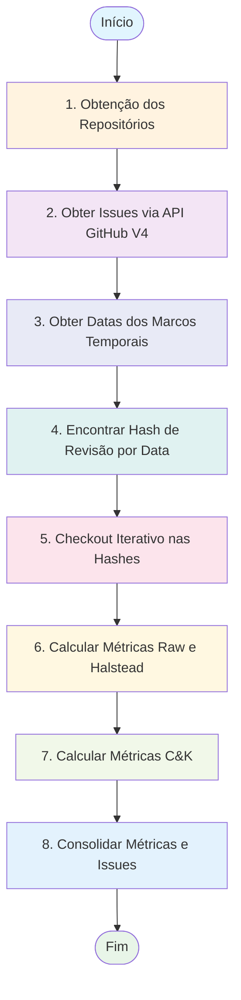
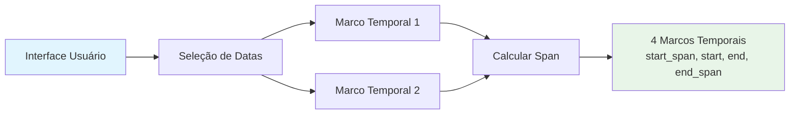
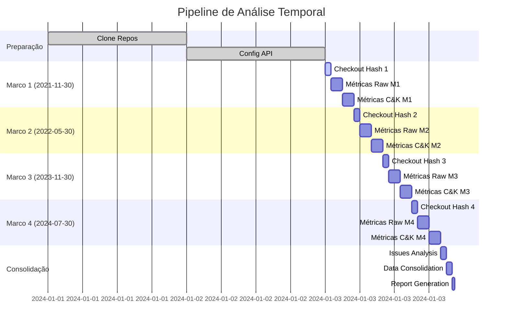

# Fluxo do Pipeline de Análise

## Visão Geral do Pipeline

O Code Insights implementa um pipeline de 7 etapas para análise completa de qualidade de código ao longo do tempo:



## Detalhamento das Etapas

### 1. Obtenção dos Repositórios (Clone)

```mermaid
flowchart LR
    A[Lista de Repositórios<br/>data.py] --> B[utils.clone_repo()]
    B --> C{Repo existe<br/>localmente?}
    C -->|Não| D[git clone]
    C -->|Sim| E[Pular clone]
    D --> F[Salvar HEAD atual]
    E --> F
    F --> G[Repositório disponível<br/>localmente]
    
    style A fill:#e1f5fe
    style G fill:#e8f5e8
```

**Implementação**:
```python
def clone_repo(repos_to_clone: dict) -> bool:
    for owner, repo_name in repos_to_clone.items():
        github_endpoint = f"https://github.com/{owner}/{repo_name}.git"
        clone_path = os.path.join(CLONE_BASE_PATH, owner, repo_name)
        Repo.clone_from(github_endpoint, clone_path)
```

**Entrada**: `{"django": "django", "scikit-learn": "scikit-learn"}`  
**Saída**: Repositórios clonados em `clones/owner/repo/`

### 2. Obter Issues via API GitHub V4

```mermaid
flowchart LR
    A[Repositórios] --> B[issues.get_issues_df()]
    B --> C[GraphQL Query]
    C --> D[GitHub API v4]
    D --> E[Dados JSON]
    E --> F[Processar em DataFrame]
    F --> G[Issues DataFrame]
    
    style A fill:#e1f5fe
    style G fill:#e8f5e8
```

**Query GraphQL**:
```graphql
query {
  repository(owner: "django", name: "django") {
    issues(first: 100, states: OPEN) {
      nodes {
        number
        title
        createdAt
      }
    }
  }
}
```

**Saída**: DataFrame com colunas `repo`, `number`, `title`, `created_at`

### 3. Obter Datas dos Marcos Temporais



**Cálculo de Spans**:
```python
window_span = st.slider("Tamanho da janela (meses):", 0, 24, value=8)
SPAN = datetime.timedelta(days=30*window_span)
marcos_temporais = [repo_start-SPAN, repo_start, repo_end, repo_end+SPAN]
```

**Exemplo**:
- Marco 1: 2021-11-30 (início)
- Marco 2: 2023-11-30 (fim)
- Span: 8 meses
- Resultado: [2021-03-30, 2021-11-30, 2023-11-30, 2024-07-30]

### 4. Encontrar Hash de Revisão por Data

```mermaid
flowchart LR
    A[Marcos Temporais] --> B[utils.get_commit_hash_by_date()]
    B --> C[git rev-list --before]
    C --> D[Hash do Commit]
    D --> E[Lista de Hashes<br/>para Checkout]
    
    style A fill:#e1f5fe
    style E fill:#e8f5e8
```

**Comando Git**:
```bash
git rev-list -1 --before="2021-11-30 00:00:00" main
```

**Saída**: Lista de hashes correspondentes a cada marco temporal

### 5. Checkout Iterativo nas Hashes

```mermaid
flowchart TD
    A[Lista de Hashes] --> B[Para cada Hash]
    B --> C[utils.checkout_git_revision()]
    C --> D[git checkout hash]
    D --> E[Salvar revisão atual]
    E --> F[Repositório na revisão H]
    F --> G{Mais hashes?}
    G -->|Sim| B
    G -->|Não| H[Todos checkouts completos]
    
    style A fill:#e1f5fe
    style H fill:#e8f5e8
```

**Implementação**:
```python
for hash_revision in hashes_utilizaveis:
    utils.checkout_git_revision(repo_dir, hash_revision)
    # Processar métricas para esta revisão
```

### 6. Calcular Métricas Raw e Halstead

```mermaid
flowchart LR
    A[Repositório na<br/>Revisão H] --> B[analytics.get_project_metrics()]
    B --> C[Percorrer arquivos .py]
    C --> D[radon.raw.analyze()]
    C --> E[radon.metrics.h_visit()]
    C --> F[radon.complexity.cc_visit()]
    D --> G[Consolidar métricas<br/>por arquivo]
    E --> G
    F --> G
    G --> H[Métricas Raw/Halstead]
    
    style A fill:#e1f5fe
    style H fill:#e8f5e8
```

**Métricas Calculadas**:
- **Raw**: LOC, LLOC, SLOC, Comments, Multi, Blank
- **Halstead**: Volume, Difficulty, Effort  
- **Complexidade**: Ciclomática média
- **Manutenibilidade**: Índice de manutenibilidade

### 7. Calcular Métricas Chidamber & Kemerer

```mermaid
flowchart LR
    A[Repositório na<br/>Revisão H] --> B[analytics.get_ck_metrics()]
    B --> C[Percorrer arquivos .py]
    C --> D[ast.parse()]
    D --> E[CKAnalyzer.visit()]
    E --> F[Extrair classes e métodos]
    F --> G[Calcular WMC, DIT, NOC<br/>RFC, CBO, LCOM]
    G --> H[Métricas C&K<br/>por classe]
    
    style A fill:#e1f5fe
    style H fill:#e8f5e8
```

**Métricas C&K**:
- **WMC**: Weighted Methods per Class
- **DIT**: Depth of Inheritance Tree  
- **NOC**: Number of Children
- **RFC**: Response for a Class
- **CBO**: Coupling Between Objects
- **LCOM**: Lack of Cohesion of Methods

### 8. Consolidar Métricas e Issues

```mermaid
flowchart LR
    A[Métricas Raw/Halstead] --> D[analytics.get_project_statistics()]
    B[Métricas C&K] --> E[Dados Consolidados]
    C[Issues DataFrame] --> F[issues.compute_issue_metrics()]
    D --> G[Relatório Final]
    E --> G
    F --> G
    G --> H[Visualização Streamlit]
    
    style A fill:#fff3e0
    style B fill:#f3e5f5
    style C fill:#e8eaf6
    style H fill:#e8f5e8
```

**Consolidação**:
```python
def gerar_tabelas(hash_revision, repo_dir, project_name):
    # Processa métricas para uma revisão específica
    raw_metrics = analytics.get_project_metrics(repo_dir)
    ck_metrics = analytics.get_ck_metrics(repo_dir)
    statistics = analytics.get_project_statistics(raw_metrics, hash_revision)
    issues_metrics = process_issues_metrics(repo_org, repo_name)
    
    # Exibe no Streamlit
    st.dataframe(projeto_to_dataframe(raw_metrics))
    st.dataframe(ck_metrics_to_dataframe(ck_metrics))
```

## Fluxo Temporal Completo



## Saídas do Pipeline

### Por Revisão
- **Métricas Raw**: DataFrame com métricas por arquivo
- **Métricas C&K**: DataFrame com métricas por classe  
- **Estatísticas**: Agregações do projeto completo

### Consolidado
- **Timeline Plot**: Visualização dos marcos temporais
- **Comparative Tables**: Métricas entre revisões
- **Issues Analysis**: Correlação temporal com issues
- **Quality Evolution**: Tendências de qualidade ao longo do tempo

## Otimizações e Cache

### Cache de Revisões
```python
def save_current_revision_repo(repo_path: str, revision: str):
    # Salva em current/{project}.ciconf para reuso
```

### Processamento Paralelo
- Métricas Raw e C&K podem ser calculadas em paralelo
- Issues processadas independentemente
- Cache de clones evita re-downloads

### Tratamento de Erros
- Fallback para revisões não encontradas
- Skip de arquivos com erro de sintaxe  
- Logs detalhados para debugging